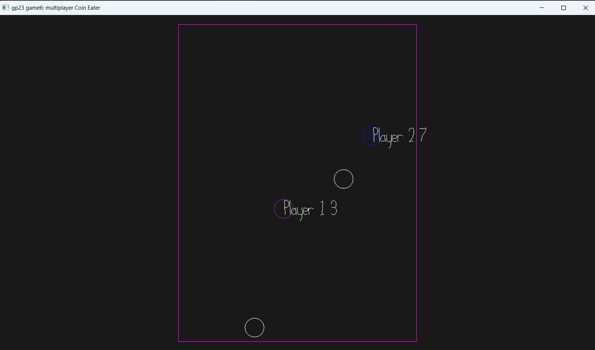

# MultiplayerEatingCoin

Author: Yiquz

Design: 
Rule1: eat one coin to get one point.when you eat ,coin will respawn
Rule2: if you hit other player, both of you will reduce 1 points.

Networking: In server.cpp, I respawn coin everytime new player enter.
In Game.cpp send_state_message, server is sending the data that need sync to clients
Also, in  recv_state_message, client(Playmode) need to receive informations from server and use it for objects.

Messages: Player velocity, coin count, position; Coin position.

Screen Shot:

How To Play:

Move Around to eat Coin
Hit other player to reduce their point if you have more points.

This game was built with [NEST](NEST.md).

